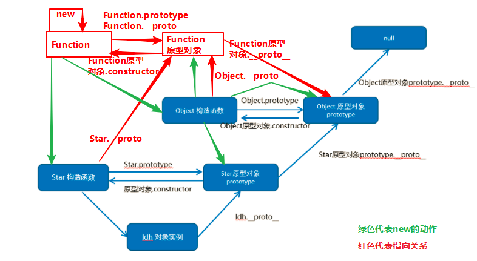

[TOC]

# 函数声明

**函数关键字方式声明的函数：**

可以先调用，再定义。

**函数表达式方式/匿名函数：**

不能先调用再定义。

# 作用域

**es5里没有块级作用域：**

if、while、for里都会用到{},es5里没有块级作用域，

        所以在这些{}里定义的变量都是全局变量

**es6里有块级作用域：**

在块级作用域内用let关键字定义的变量，{}外访问不到


# 预解析（变量/函数 的提升）

**1、变量和函数同名时**：

变量名已赋值时，变量的优先级更高，和顺序无关
变量名未赋值时，函数的优先级更高，和顺序无关

**2、变量提升只发生在es5里，es6里没有变量提升**

**3、对函数return关键字后面的代码也会发生预解析**

**4、当声明的变量已赋值并且和函数名相同时，变量的优先级更高，跟赋值的顺序没有关系。**

**当声明的变量未赋值并且和函数名相同时，函数的优先级更高，跟声明的顺序没有关系。**


# 原型链

构造函数的显示原型就是构造函数的实例对象的隐式原型




```javascript
// Function对象的隐式原型对象和显式原型对象是同一个对象
console.log(Function.__proto__ === Function.prototype);//true

// Function是一个比较特殊的对象，和Object互为对方的一个实例
console.log(Function instanceof Object);//true
console.log(Object instanceof Function);//true

// Object是Function的实例对象
console.log(Function.prototype === Object.__proto__);//true

// 重点理解：Function的原型对象是Object的实例对象
console.log(Function.prototype.__proto__ === Object.prototype);//true
```


# 包装对象

包装对象一共有三种：数字、字符串、布尔值

```javascript
// 下面代码有什么问题？
var str = 'andy';
console.log(str.length);
```

按道理基本数据类型是没有属性和方法的，而对象才有属性和方法，但上面代码却可以执行，这是因为js 会把基本数据类型包装为复杂数据类型，其执行过程如下 ：

```javascript
// 1. 生成临时变量，把简单类型包装为复杂数据类型
var str = new String('andy');
// 2. str对象访问length属性并打印
console.log(str.length);
// 3. 将字符串赋值给变量
str = "andy";
```

> 包装对象new + Number \String\Boolean 的独有属性 ：**primitiveValue**


# 事件冒泡


onblur、onfocus、onmouseenter、onmouseleave没有冒泡

# 事件委托

可利用事件委托机制给未来元素添加事件