[TOC]


# Node.js基础

## 1.fs模块

> fs模块是nodejs中最常用的一个模块之一，因此掌握fs模块非常的有必要，fs模块的方法非常多,用到了哪个查哪个即可。
>
> 文档地址：http://nodejs.cn/api/fs.html

  在nodejs中，提供了fs模块，这是node的核心模块

  注意：

1. 除了global模块中的内容可以直接使用，其他模块都是需要加载的。
2. fs模块不是全局的，不能直接使用。因此需要导入才能使用。

~~~js
const fs = require("fs");
~~~


## 2. 读取文件

> ​	语法：fs.readFile(path[, options], callback)

方式一：不传编码参数

~~~js
//参数1： 文件的名字
//参数2： 读取文件的回调函数
  //参数1：错误对象，如果读取失败，err是一个错误对象，包含错误信息，如果读取成功，err是null
  //参数2：读取成功后的数据（是一个Buffer对象）
fs.readFile("data.txt", function(err, data){
  console.log(err);
  console.log(data);
});
~~~

方式二：传编码参数

~~~js
//参数1： 文件的路径
//参数2： 编码，如果设置了，返回一个字符串，如果没有设置，会返回一个buffer对象
//参数3： 回调函数
fs.readFile("data.txt", "utf8",function(err, data){
  console.log(err);
  console.log(data);
});
~~~


关于Buffer对象

~~~js
1. Buffer对象是Nodejs用于处理二进制数据的。
2. 其实任意的数据在计算机底层都是二进制数据，因为计算机只认识二进制。
3. 所以读取任意的文件，返回的结果都是二进制数据，即Buffer对象
4. Buffer对象可以调用toString()方法转换成字符串。
~~~

## 3.fs模块之写入数据

>语法：fs.writeFile(filePath, data[, options], callback)

~~~js
//参数1：写入的文件名(如果文件不存在，会自动创建)
//参数2：写入的文件内容（注意：写入的内容会覆盖以前的内容）
//参数3：写文件后的回调函数
fs.writeFile("2.txt", "hello world, 我是一个中国人", function(err){
  if(err) {
    return console.log("写入文件失败", err);
  }
  console.log("写入文件成功");
});
~~~

**注意：**

- 写文件的时候，会把原来的内容给覆盖掉

## 4. 追加数据到文件中

>语法：fs.appendFile(path, data[, options], callback)

~~~js
//参数1：追加的文件名(如果文件不存在，会自动创建)
//参数2：追加的文件内容（注意：写入的内容会覆盖以前的内容）
//参数3：追加文件后的回调函数
fs.appendFile("2.txt", "我是追加的内容", function(err){
 // if(err) {
 //   return console.log("追加文件内容失败");
 // }
  if(err) return console.log("追加文件内容失败");
  console.log("追加文件内容成功");
})
~~~

## 5. 同步与异步的说明

>fs中所有的文件操作，都提供了异步和同步两种方式

异步方式：不会阻塞代码的执行

~~~js
//异步方式
var fs = require("fs");

console.log(111);
fs.readFile("2.txt", "utf8", function(err, data){
  if(err) {
    return console.log("读取文件失败", err);
  }
  console.log(data);
});
console.log("222");
~~~


同步方式：会阻塞代码的执行

~~~js
//同步方式
console.log(111);
var result = fs.readFileSync("2.txt", "utf-8");
console.log(result);
console.log(222);
~~~

总结：同步操作使用虽然简单，但是会影响性能，因此尽量使用异步方法，尤其是在工作过程中。

## 6. 其它API(了解)

方法有很多，但是用起来都非常的简单，学会查文档

文档：http://nodejs.cn/api/fs.html

| 方法名                                  | 描述                   |
| --------------------------------------- | ---------------------- |
| `fs.readFile(path, callback)`           | 读取文件内容（异步）   |
| `fs.readFileSync(path)`                 | 读取文件内容（同步）   |
| `fs.writeFile(path, data, callback)`    | 写入文件内容（异步）   |
| `fs.writeFileSync(path, data)`          | 写入文件内容（同步）   |
| `fs.appendFile(path, data, callback)`   | 追加文件内容（异步）   |
| `fs.appendFileSync(path, data)`         | 追加文件内容（同步）   |
| `fs.rename(oldPath, newPath, callback)` | 重命名文件（异步）     |
| `fs.renameSync(oldPath, newPath)`       | 重命名文件（同步）     |
| `fs.unlink(path, callback)`             | 删除文件（异步）       |
| `fs.unlinkSync(path)`                   | 删除文件（同步）       |
| `fs.mkdir(path, mode, callback)`        | 创建文件夹（异步）     |
| `fs.mkdirSync(path, mode)`              | 创建文件夹（同步）     |
| `fs.rmdir(path, callback)`              | 删除文件夹（异步）     |
| `fs.rmdirSync(path)`                    | 删除文件夹（同步）     |
| `fs.readdir(path, option, callback)`    | 读取文件夹内容（异步） |
| `fs.readdirSync(path, option)`          | 读取文件夹内容（同步） |
| `fs.stat(path, callback)`               | 查看文件状态（异步）   |
| `fs.statSync(path)`                     | 查看文件状态（同步）   |

## 7. path模块

**路径操作的问题**

在读写文件的时候，文件路径可以写相对路径或者绝对路径

~~~js
//data.txt是相对路径，读取当前目录下的data.txt, 相对路径相对的是指向node命令的路径
//如果node命令不是在当前目录下执行就会报错， 在当前执行node命令的目录下查找data.txt，找不到
fs.readFile("data.txt", "utf8", function(err, data) {
  if(err) {
    console.log("读取文件失败", err);
  }

  console.log(data);
});
~~~

相对路径：相对于执行node命令的路径

绝对路径：`__dirname`: 当前文件所在的目录，`__filename`: 当前文件的目录，包含文件名


**path模块的常用方法**

>关于路径，在linux系统中，路径分隔符使用的是`/`，但是在windows系统中，路径使用的`\`

在我们拼写路径的时候会带来很多的麻烦，经常会出现windows下写的代码，在linux操作系统下执行不了

path模块就是为了解决这个问题而存在的。

示例如下:

~~~js
path.join();//拼接路径

//windows系统下
> path.join("abc","def","gg", "index.html")
"abc\def\gg\a.html"

//linux系统下
> path.join("abc","def","gg", "index.html")
'abc/def/gg/index.html'

path.basename(path[, ext])	返回文件的最后一部分
path.dirname(path)	返回路径的目录名
path.extname(path)	获取路径的扩展名

var path = require("path");
var temp = "abc\\def\\gg\\a.html";
console.log(path.basename(temp));//a.html
console.log(path.dirname(temp));//abc\def\gg
console.log(path.extname(temp));//.html
~~~


## 8. path模块的其它API(了解)

| 方法名                       | 描述                                 |
| ---------------------------- | ------------------------------------ |
| `path.basename(path[, ext])` | 返回文件的最后一部分                 |
| `path.dirname(path)`         | 返回路径的目录名                     |
| `path.extname(path)`         | 获取路径的扩展名                     |
| `path.isAbsolute(path)`      | 判断目录是否是绝对路径               |
| `path.join([...paths])`      | 将所有的path片段拼接成一个规范的路径 |
| `path.normalize(path)`       | 规范化路径                           |
| `path.parse(path)`           | 将一个路径解析成一个path对象         |
| `path.format(pathObj)`       | 将一个path对象解析成一个规范的路径   |

## 9. http模块

http模块可以用来创建服务器

基本步骤及代码：

~~~js
// 1. 引入http模块
const http = require('http')
// 2. 创建服务器对象
const server = http.createServer()
// 3. 监听端口并开启服务器
server.listen(3000,()=>{
  console.log('server is running at http://127.0.0.1:3000');
})
// 4.注册事件 监听请求
server.on('request',(req,res)=>{
  // req request的缩写是一个请求对象 所有的请求相关的内容都在这个req对象当中
  // res response的缩写是一个响应对象 所有的响应相关的内容都在这个res对象当中
  // res.write('hello'); // 表示向浏览器响应数据
  // res.write('world'); // 可以响应多次
  // res.end() // 表示所有的数据都响应完毕了

  // res.end('hello world123') // 相当于是res.write('hello world123') + res.end()
  // res.end('<p>这是一个段落标签...</p>')  // 直接向浏览器端响应数据
  res.end('900') // 响应的数据只能是二进制或字符串
})
// ctrl + c 停止服务器
~~~

**详细说明:**

1. http是一个内置模块对象，可以通过`createServer()`方法来创建服务对象
2. listen是一个方法,此方法有三个参数
   - 第1个参数表示要监听的端口
   - 第2个参数表示服务器的地址,如果不写默认是:  `127.0.0.1`
   - 第3个参数是一个箭头函数,表示端口监听时要进行的操作
3. 给服务器注册request事件，只要服务器接收到了客户端的请求，就会触发request事件
4. request事件有两个参数:
   - req:     request的缩写 表示请求对象，可以获取所有与请求相关的信息，
   - res:     response的缩写 表示响应对象，可以获取所有与响应相关的信息。
5. 服务器监听的端口范围为：1-65535之间，推荐使用3000以上的端口，因为3000以下的端口一般留给系统使用
6. 前后端数据交互的格式只有两种
   - 二进制
   - 字符串

## 10. request对象详解

文档地址：http://nodejs.cn/api/http.html#http_message_headers

常见属性：

```javascript
headers: 所有的请求头信息
method： 请求的方式 GET/POST
url： 请求的地址 获取的是端口号后面的所有的数据
```

代码如下:

~~~js
// - 4.注册事件，监听请求
let num = 0
app.on('request', (req, res) => {
  // 只要是浏览器端向127.0.0.1:3000这个目标地址发送的请求，都会进到这个回调函数当中
  // req request的缩写是一个请求对象 所有的请求相关的内容都在这个req对象当中
  // res response的缩写是一个响应对象 所有的响应相关的内容都在这个res对象当中
  // res.write('aaaaa') // 表示向浏览器响应内容
  // res.write('bbbbbbbbb')
  // res.end('aaaaaaaaaabbbbbbbbbb')
  // num++
  // res.setHeader('content-Type', 'text/plain;charset=utf-8')
  // res.end('来了,老弟儿' + num)

  // console.log(req)
  console.log(req.url) // 获取的是端口号后面的所有的数据
  console.log(req.method) // 请求的方式 GET/POST
  console.log(req.headers) // 请求头信息 数据比较多
  res.end('OK')
})
~~~


**注意：**在发送请求的时候，可能会出现两次请求的情况，这是因为谷歌浏览器会自动增加一个`favicon.ico`的请求。

**小结：**

- request对象中，常用的就是**method**和**url**两个参数

## 11. response对象详解

文档地址：http://nodejs.cn/api/http.html#http_class_http_serverresponse

常见的属性和方法：

```js
res.write(data): 给浏览器发送请求体，可以调用多次，从而提供连续的请求体
res.end();   通知服务器，所有响应头和响应主体都已被发送，即服务器将其视为已完成。
res.end(data); 结束请求，并且响应一段内容，相当于: res.write(data) + res.end()
res.statusCode: 响应的的状态码 200 404 500
res.statusMessage: 响应的状态信息， OK Not Found ,会根据statusCode自动设置。
res.setHeader(name, value); 设置响应头信息， 比如content-type
res.writeHead(statusCode[, statusMessage], options); 设置响应头，同时可以设置状态码和状态信息。
```

示例代码:

~~~js
let num = 0
app.on('request', (req, res) => {
  // 只要是浏览器端向127.0.0.1:3000这个目标地址发送的请求，都会进到这个回调函数当中
  let url = req.url
  console.log(url)
  let method = req.method
  if (method == 'GET' && url == '/index.html') {
    fs.readFile(path.join(__dirname, './index.html'), (err, data) => {
      if (err) return console.log('读取失败...')
      res.end(data)
    })
  } else {
    // 如果路径不对的话,就到了这个else当中了，则返回404的信息 并且最好返回一个404的状态码
    // 一般来说,我们不会主动的去设置状态码和状态信息 服务器会自动的根据状态码来设置一个合适的状态信息
    // res.statusCode = 404
    // res.statusMessage = 'the file is not found'
    // res.end('404')
    // res.setHeader('content-type', 'text/plain;charset=utf-8')
    res.writeHead(404, {
      'content-type': 'text/plain;charset=utf-8',
      'aaaa': 'bbbbbbbbb'
    })

    res.end('你找的文件不存在...')  // res.end执行了之后，后面的代码不再执行了
	  console.log('111111111111111'); // 不再执行了
  }
})
~~~

**注意：必须先设置响应头，才能设置响应。** 

## 实现静态WEB服务器

**服务器响应首页**

- 注意：浏览器中输入的URL地址，仅仅是一个标识，不与服务器中的目录一致。
- 也就是说：返回什么内容是由服务端的逻辑决定

~~~js
// 1. 引入模块
const http = require('http')
const path = require('path')
const fs = require('fs')
// 2. 创建服务器实例对象
const server = http.createServer()
// 3. 监听端口并开启服务器
server.listen(3000, () => {
  console.log('server is running at 127.0.0.1:3000')
})
// 4. 注册事件,并响应数据
server.on('request', (req, res) => {
  // 读取静态文件中的数据,响应给浏览器
  fs.readFile(path.join(__dirname,'./views/index.html'),(err,data)=>{
    // 读取失败要报错
    if(err) return console.log(err.message); 
    // 将读取到的数据响应给浏览器
    res.end(data)
  })
})
~~~

##  根据不同的路径，响应不同的页面

**思考**：如果有如下的需求怎么办？

- 1.如果浏览器端输入的是`http://127.0.0.1:3000/index.html`，则要显示index.html页面内容
- 2.如果浏览器端输入的是`http://127.0.0.1:3000/movie.html`，则要显示movie.html页面内容
- 3.如果浏览器端输入的是`http://127.0.0.1:3000/detail.html`，则要显示detail.html页面内容

**思路：**

- 1.使用`req.url`获取浏览器端发送过来的请求路径   请求路径是**端口号**后面的内容
- 2.使用`req.method`获取请求方式
- 3.根据路径和请求方式来**判断**，然后响应不同的页面**源代码**
- 4.如果文件不存在，那么会读取失败，响应404页面

~~~js
// 1. 引入模块
const http = require('http')
const path = require('path')
const fs = require('fs')
// 2. 创建服务器实例对象
const server = http.createServer()
// 3. 监听端口并开启服务器
server.listen(3000, () => {
  console.log('server is running at 127.0.0.1:3000')
})
// 4. 注册事件,处理请求
server.on('request', (req, res) => {
  // 4.1 获取请求的路径
  let url = req.url
  // 4.2 获取请求的方式
  let method = req.method
  // 4.3 根据不同的请求路径和方式响应不同的页面
  if (method == 'GET' && (url == '/' || url == '/index.html')) {
    fs.readFile(path.join(__dirname, './views/index.html'), (err, data) => {
      if (err) return console.log(err.message)
      res.end(data)
    })
  } else if (method == 'GET' && url == '/movie.html') {
    fs.readFile(path.join(__dirname, './views/movie.html'), (err, data) => {
      if (err) return console.log(err.message)
      res.end(data)
    })
  } else if (method == 'GET' && url == '/detail.html') {
    fs.readFile(path.join(__dirname, './views/detail.html'), (err, data) => {
      if (err) return console.log(err.message)
      res.end(data)
    })
  } else {
    res.statusCode = 404
    res.end('404,file not found...')
  }
})
~~~

**延伸:**

- 如果有css样式,图片及js文件会如何呢？

## 重点小结

### 1. 创建服务器的四个步骤：

1.  导入http模块
2.  创建服务器`createServer`
3.  启动服务器，监听一个端口，0-65535之间
4.  给服务器注册`request`事件，有两个参数，req代表请求，res代表响应

### 2. req对象中常用的属性

1. req.url： 获取用户请求的地址
2. req.method ：获取用户的请求方式
3. req.headers：获取所有的请求头

### 3. res对象中常用的属性和方法

1. res.write() : 发送一段响应体，可以多次调用
2. res.end(): 结束响应，每个请求，都必须调用end()
3. res.setHeader(): 设置响应头的，需要设置`content-type`
4. res.statusCode： 设置状态码 200 404 500
5. res.writeHead() : 可以同时设置状态码和响应头

### 4.path模块

​    1.可以非常方便的用来拼接路径，无论是Linux，还是Windows

​	2.常用方法：path.join()

### 5.__dirname

​	1.获取当前文件的绝对路径，是从盘符开始的

​	2.常用于读写文件时的路径拼接

### 6.fs模块

​	1.此模块是用于读写文件用的

​	2.常用方法: fs.readFile()    fs.writeFile()  fs.appendFile()


------


# 12.NPM-Node包管理工具

## 12.1 npm的基本概念

- node package manager  node的包管理器 (第三方模块)
- [npm官网](https://npmjs.com)
- [npm中文文档](https://www.npmjs.com.cn/)

~~~json
1. npm 是node的包管理工具，
2. 它是世界上最大的软件注册表，每星期大约有 30 亿次的下载量，包含超过 600000 个 包（package） （即，代码模块）。
3. 来自各大洲的开源软件开发者使用 npm 互相分享和借鉴。包的结构使您能够轻松跟踪依赖项和版本。
~~~

- 作用：通过`npm`来快速安装开发中使用的包
- npm不需要单独安装，只要安装了node，就自带了`npm`

## 12.2 配置下载源

原始的npm包是从`https://www.npmjs.com/`下载的，这是一个外国的网站，可能会导致下载速度比较慢

为了有一个更快的下载速度，淘宝将npm官方网站的那些模块或包同步到了国内的淘宝提供的服务器上

查看镜像源

~~~js
npm config list
~~~

因此可以镜像源切换到国内淘宝提供的服务器

~~~js
npm config set registry https://registry.npm.taobao.org --global
npm config set disturl https://npm.taobao.org/dist --global
~~~

## 12.3 nrm的使用

`nrm：npm registry manager`（npm仓库地址管理工具）

如果在国内开发的话，可以使用淘宝服务器提供的镜像

如果是在国外开发的话，可以使用国外的官方镜像源

因此，我们可以使用nrm来方便的切换镜像源

**安装nrm**

~~~js
npm i -g nrm    // -g 就是--global的缩写  i是install的缩写
~~~

**查看当前镜像源**

~~~js
nrm ls   // 带*表示当前正在使用的地址  ls就是list的缩写
~~~

切换镜像源地址

~~~js
nrm use taobao  // 切换到淘宝提供的镜像源  以后下载的包都是从淘宝镜像源服务器来下载
~~~

## 12.4 npm基本使用

**初始化包**

```javascript
npm init;    //这个命令用于初始化一个包，创建一个package.json文件，我们的项目都应该先执行npm init
npm init -y;  //快速的初始化一个包， 不能是一个中文名
```

**安装包**

```javascript
npm install 包名;  //安装指定的包名的最新版本到项目中
npm install 包名@版本号;  //安装指定包的指定版本

npm i 包名； //简写  如果下载下了别人的项目之后，需要下载项目中使用的依赖包的话，一定要 npm i 
```

**卸载包**

```javascript
npm uninstall 包名;  //卸载已经安装的包
```

**清除缓存**

``` javascript
npm cache clean -f // 如果npm安装失败了，可以用这个命令来清除缓存
```

快速下载项目中所有的依赖项：

~~~js
npm i   // 这个命令会根据package.json文件中的依赖项去下载对应的第三方库或包
~~~

## 12.5 package.json文件

package.json文件，包（项目）描述文件，用来管理组织一个包（项目），它是一个纯JSON格式的。

- 作用：描述当前项目（包）的信息，描述当前包（项目）的依赖项

- 如何生成：`npm init`或者`npm init -y`

- 作用

  - 作为一个标准的包，必须要有`package.json`文件进行描述
  - 一个项目的node_modules目录通常都会很大，不用拷贝node_modules目录，
  - 可以通过package.json文件配合`npm install`直接安装项目所有的依赖项

- 描述内容

  ~~~json
  {
    "name": "03-npm",  //描述了包的名字，不能有中文
    "version": "1.0.0",  //描述了包的的版本信息， x.y.z  如果只是修复bug，需要更新Z位。如果是新增了功能，但是向下兼容，需要更新Y位。如果有大变动，向下不兼容，需要更新X位。
    "description": "", //包的描述信息
    "main": "index.js", //入口文件（模块化加载规则的时候详细的讲）
    "scripts": {  //配置一些脚本，在vue的时候会用到，现在体会不到
      "test": "echo \"Error: no test specified\" && exit 1"
    },
    "keywords": [],  //关键字（方便搜索）
    "author": "",  //作者的信息
    "license": "ISC",  //许可证，开源协议
    "dependencies": {   //重要，项目的依赖， 方便代码的共享  通过 npm install可以直接安装所有的依赖项
      "bootstrap": "^3.3.7",
      "jquery": "^3.3.1"
    }
  }
  ~~~

  **注意：一个合法的package.json，必须要有name和version两个属性** 

## 12.6 安装依赖

所谓依赖，就是当前项目用到的第三方模块或是软件包

依赖分两种

- 一个是**部署依赖**，即：在**开发和部署**上线都需要使用的包  
  - 使用命令：`npm install 包名 --save`  其中：`--save` 可以简单写成`-S`
  - 如果不写`--save`或`-S`，默认就是安装到部署依赖
- 一个是**开发依赖**，即：只在项目**开发阶段**需要用到的包，比如某些打包工具，格式化工具等...
  - 命令：`npm install 包名 --save-dev`    其中：` --save-dev`可以简写成`-D`


------


# 13. MIME

## 13.1 MIME的说明

[MIME 类型](https://developer.mozilla.org/zh-CN/docs/Web/HTTP/Basics_of_HTTP/MIME_Types)

- 1.MIME(Multipurpose Internet Mail Extensions)多用途Internet邮件扩展类型 是一种表示文档性质和格式的标准化方式
- 2.浏览器通常使用MIME类型（而不是文件扩展名）来确定如何处理文档；
- 3.常见的[mime类型]( https://baike.baidu.com/item/MIME/2900607?fr=aladdin )
- 4.因此服务器将正确的MIME类型附加到响应对象的头部是非常重要的
- 5.通过响应头的`content-type`可以设置mime类型
- 6.如果没有给浏览器设置正确的mime类型，浏览器会根据响应的内容猜测对应的mime类型。
- 7.但是不能保证所以浏览器能够得到一致的效果。
- 8. **对于服务器开发，需要给每一个响应都设置一个正确的mime类型** 

## 13.2 mime模块的使用

nodejs核心并没有提供用于处理mime的模块。但是我们可以在`npm`上下载开发中遇到的第三方包。

安装：

~~~json
npm i mime
~~~

使用：

~~~json
// 引入mime模块
const mime = require('mine')
// 获取路径对应的MIME类型
console.log(mime.getType('.css'))
console.log(mime.getType('.html'))
console.log(mime.getType('.gif'))
...
// 也可以根据路径来生成指定的mime类型
console.log(mime.getType('http://127.0.0.1:3000/views/index.html'))
console.log(mime.getType('http://127.0.0.1:3000/views/index.css'))
console.log(mime.getType('http://127.0.0.1:3000/views/index.js'))
console.log(mime.getType('http://127.0.0.1:3000/images/aa.jpg'))
console.log(mime.getType('http://127.0.0.1:3000/images/aa.gif'))
~~~


------


# 14.JSON

## 14.1 JSON语法规则

即 JavaScript Object Notation，另一种轻量级的文本数据交换格式，独立于语言。

**语法规则**

1、JSON 中属性名称必须用双引号包裹

2、JSON 中表述字符串必须使用双引号

3、JSON 中不能有单行或多行注释

4、JSON中数据由逗号分隔(最后一个健/值对不能带逗号)

5、JSON中花括号保存对象方括号保存数组

6、JSON 没有 `undefined` 这个值

~~~js
[
  {
    "id": 1,
    "name": "tom",
    "age": 18,
    "gender": "男",
    "zhuanye": "前端",
    "address": "松江区"
  },
  {
    "id": 2,
    "name": "rose",
    "age": 19,
    "gender": "女",
    "zhuanye": "大数据",
    "address": "宝山区"
  },
  {
    "id": 3,
    "name": "jerry",
    "age": 20,
    "gender": "男",
    "zhuanye": "python",
    "address": "奉贤区"
  },
  {
    "id": 4,
    "name": "jodan",
    "age": 21,
    "gender": "男",
    "zhuanye": "java",
    "address": "闵行区"
  }
]
~~~

前后端数据传输的格式只有两种：

- 1.字符串    一些普通的数据  html   css   .js  ...
- 2.二进制     图片  视频   音乐 大文件 ...

## 14.2 JSON数据解析

**JSON解析**

JSON数据在不同语言进行传输时，类型为字符串，不同的语言各自也都对应有解析方法，需要解析完成后才能读取

1、Javascript 解析方法

JSON对象 JSON.parse()、 JSON.stringify()；

JSON.parse()是将字符串形式的JSON数据转换成真正的JSON对象

总结：JSON体积小、解析方便且高效，在实际开发成为首选。

## 14.3JSON对象与普通对象的区别

**相同点**:

- 1. 都有{}包裹
- 2. 都是键值对的形式
- 3. 属性值的访问方式都是一样的 obj.name obj1.name []

**不同点:**

- 1. JSON格式的对象属性必须是""包裹
  2. 属性值如果是字符串也必须是""包裹

~~~js
const obj = {
  name:'jack',
  age:20,
  gender:'男'
} 
const arr = [
  {name:'rose',age:20},
  {name:'jerry',age:21}
]

const obj1 = {
  "name":"rose",
  "age":22,
  "gen der":"女"
}
const arr1 = [
  {"name":"tom","age":22},
  {"name":"张三","age":24}
]

// JSON对象中属性值的获取与普通对象一样
console.log(obj.name,obj1.name);
console.log(obj['age'],obj1['age']);
console.log(obj.gender,obj1['gen der']);
~~~


------


# 15. 在node当中使用art-template

[文档][https://aui.github.io/art-template/zh-cn/docs/]

**作用:**

- 1.将数据快速高效的替换到html页面中需要的位置
- 2.大大提高开发效率

## 15.1 安装

~~~js
npm i art-template
~~~

## 15.2 使用

~~~js
// 在项目当中引入art-template模板
const template = require('art-template')
// 使用template方法将数据和html标签中的结构进行绑定
// template有两个参数 
// 第1个参数是待渲染数据的html，要使用路径找到这个文件
// 第2个参数是待渲染的数据，必须是一个对象  
// html页面中数据的呈现，与原来浏览器端使用art-template模板一模一样的，该循环的循环，该判断的判断，也是{{}}的形式
let htmlStr = template(path.join(__dirname,'./views/index.html'),{name:'tom',age:20,gender:'男'})
~~~

`注意`：文件的路径必须是**绝对路径**


------


# 16.处理GET方式传递的参数

客户端浏览器在使用**get方式**发送数据的时候(比如注册账号)，会在URL地址的后面用?来拼接参数，格式如下:

`http://127.0.0.1:3000/add?name=tom&age=20&gender=男`

## 3.1 url模块介绍

- 如果前端浏览器发送过来的请求地址当中，没有参数的话，直接使用req.url来获取路径就可以了
- 因为req.url获取的就是端口号后面的内容 比如:`http://127.0.0.1:3000/views/index.html` 路径:`/views/index.html`
- 如果请求的路径中带参数了比如:`http://127.0.0.1:3000/add?name=tom&age=20&gender=男`再用req.url就**不好办**了
- 因此要使用一个专门的node中**内置的核心模块**，`url模块`
- 此模块是专门用来url地址的，可以将地址中的`路径`和`参数`非常方便的分开对待

## 3.2 url模块的使用

~~~js
// 引入url模块
const urlObj = require('url')
// 调用方法中的parse方法，对url地址进行解析
const obj = urlObj.parse(req.url[,true])
~~~

- 比如当前地址是：http://127.0.0.1:3000/index.html

  req.url：`/index.html`

​       ` const obj = urlObj.parse(req.url)`      **注意**，此时并没有传递第二个参数`true`

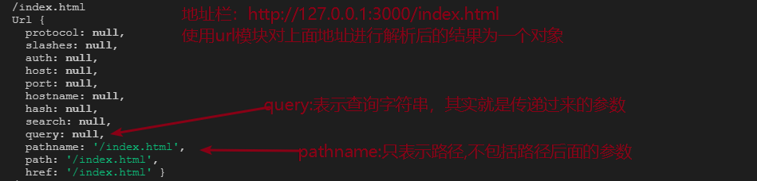

- 再来看这个地址：http://127.0.0.1:3000/index.html?id=2&name=tom

  req.url：/index.html?id=2&name=tom

  `const obj = urlObj.parse(req.url)`  **注意**，此时还是没有传递第二个参数`true`

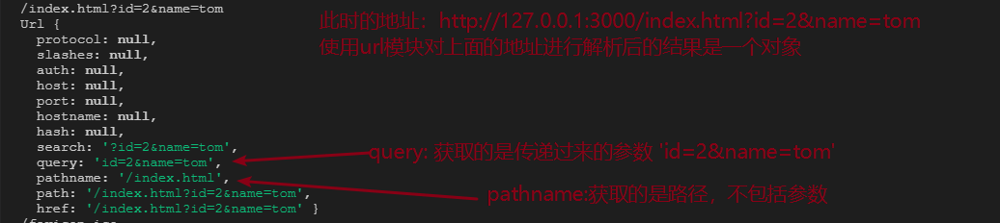

- 仍然是这个地址：http://127.0.0.1:3000/index.html?id=2&name=tom

  req.url：/index.html?id=2&name=tom

  `const obj = urlObj.parse(req.url,true)`  **注意**，此时有传递第二个参数`true`

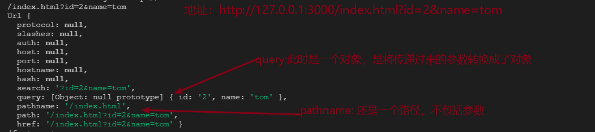

**小结**：如果在写案例或项目的时候，有参数是通过URL拼接传递过来的，则此时在node后端一定要使用url模块来解析。

- 不管请求地址中有没有参数，都要使用：`url.parse(req.url,true)`的方式来处理，返回的是一个对象
- 此对象当中有两个常用属性，一个是`pathname`,一个是`query`
- `pathname`里面存储的是地址当中的端口号和?之间的路径  比如：`/submit`
- `query`里面存储的是get方式传递过来的参数，如果没有参数则是`null`

# 17.处理POST方式传递的数据

由于POST请求的方式是通过请求体来传递数据，此时在node后端获取数据的方式如下

## 4.1获取POST请求的数据

~~~js
// data事件：用来接受客户端发送过来的POST请求数据
// 只要有数据发送过来就会不断的触发data事件 
// chunk是块的意思，表示数据是分块来传输的
let str = "";
req.on('data', chunk => {
  str += chunk;
})

// end事件：当POST数据接收完毕时，触发
req.on('end', function () {
  cosnole.log(str); // 打印出来的是一个字符串
})
~~~

## 4.2 querystring模块

- 用于解析与格式化 字符串数据
- 注意：只在专门处理查询字符串时使用

~~~js
// 引入模块
const querystring = require('querystring')
// 将字符串转换成对象
let str = 'name=tom&age=20&gender=男'
let obj = querystring.parse(str) // { name: 'tom', age: '20', gender: '男' }
~~~

# 18. 服务器端重定向

- [HTTP 状态码说明](https://developer.mozilla.org/zh-CN/docs/Web/HTTP/Status)

- 服务器端可以通过响应头中的**状态码**让浏览器中的页面进行重定向(重新跳转)

  ~~~js
  res.writeHead(302, {
    'Location': '/'
  })
  res.end()
  ~~~


------


# 19. 模块化

## 19.1 node中模块分类

- 在nodejs中，应用由模块组成，nodejs中采用commonJS模块规范。
- 一个js文件就是一个模块
- 每个模块都是一个**独立的作用域**，在这个而文件中定义的变量、函数、对象都是私有的，对其他文件不可见。
- 分类：
  - 1 `核心模块` fs path url http querystring
    - 由 node 本身提供，不需要单独安装（npm），可直接引入使用
  - 2 `第三方模块`（包）
    - 由社区或个人提供，需要通过npm安装后使用
  - 3 `自定义模块`   我们自己写的js文件称为自定义模块
    - 由我们自己创建，比如：tool.js 、 user.js

## 19.2 模块的导入(加载模块)

- 通过`require("fs")`来加载模块

- 如果是第三方模块，需要先使用npm进行下载

- 如果是**自定义模块**，需要加上相对路径`./`或者`../`,**可以省略**`.js`后缀，

- 如果文件名是`index.js`那么index.js也可以省略。

- 模块可以被多次引入，但是只会在第一次加载

- 加载核心模块

  ~~~js
  // 引入模块
  const fs = require('fs');
  ~~~

- 加载第三方模块   第三方模块要先下载，再加载

  ~~~js
  // 引入模块
  const mime = require('mime')
  const template = require('art-template')
  ~~~

- 加载用户模块

  ~~~js
  // 加载模块
  require('./a')     // 推荐使用，省略.js后缀！
  
  require('./a.js')
  ~~~

## 19.3 global全局对象

优点: 可以向外暴露数据，实现模块间数据的访问

缺点:

- 1.会造成数据覆盖的问题

- 2.分不清数据的来源

  推荐使用module.exports的方式向外导出数据

## 19.4 模块的导出

- 在模块的内部，`module`变量代表的就是当前模块，它的`exports`属性就是对外的接口，

- 加载某个模块，加载的就是`module.exports`属性，这个属性指向一个空的对象。

  ~~~js
  //module.exports指向的是一个对象，我们给对象增加属性即可。
  //module.exports.num = 123;
  //module.exports.age = 18;
  
  //通过module.exports也可以导出一个值，但是多次导出会覆盖
  module.exports = '123';
  module.exports = "abc";
  ~~~

## 19.5 module.exports与exports

- `exports` 是 `module.exports` 的引用

- 注意：给 `module.exports` 赋值会切断与 `exports` 之间的联系

  - 1 直接添加属性两者皆可
  - 2 赋值操作时，当赋值复杂数据类型时，只能使用 `module.exports`

  ~~~js
  console.log( module.exports === exports ) // ==> true
  
  // 等价操作
  module.exports.num = 123
  exports.num = 123
  
  // 赋值操作：不要使用 exports = {}
  module.exports = {}
  ~~~

global体会一下有什么好处和缺点

## 19.6模块的加载规则

1.核心模块加载规则 优先从缓存中加载,如果缓存中没有的话,再去执行加载核心模块

2.第三方模块的查找规则

~~~css
- 首先,node查看项目根目录中有没有'node_modules'文件夹
- 在'node_modules'文件夹中,查找有没有和第三方模块名称一致的文件夹
- 在此文件夹中,查找有没有‘package.json’这个文件
- 在‘package.json’文件中,查找有没有'main'属性
- 如果有'main'属性,并且'main'属性指向的路径存在,那么就尝试加载这个路径指定的文件
- 如果'package.json'文件中,没有'main'属性,或者'main'属性指向的路径不存在,
     或者没有'package.json'文件,那么，Node尝试加载模块根目录中'index'相关文件,
     加载顺序和之前一样 index.js-->index.json-->index.node
- 如果在'node_modules'文件夹中,找不到对应的模块文件,或者在项目根目录中根本
     没有'node_modules'文件,则向上一层文件夹中去查找,查找规则同上
- 如果上一层目录中也没有查找到,则再向上一层去查找,直到找到当前项目所在的盘符
     根目录为止如果找到了盘符根目录还找不到，
     则报错:'cannot find module ***'
~~~

3.用户模块的查找规则

~~~js
-  如果不写后缀名,则严格按照给定的文件名去查找模块并加载执行
-  index--> index.js --> index.json --> index.node
~~~


------


# 20.表单处理

> 表单（form）：表单用于收集用户输入信息，并将数据提交给服务器。是一种常见的与服务端数据交互的一种方式

```html
<body>
  <form action="/add" method="get">
    用户名: <input type="text" name="userName"><br />
    密　码: <input type="text" name="password"><br />
    <!-- <input type="submit" value="注册"> -->
    <!-- 或是下面的这种写法 -->
    <button>提交</button>
    <!-- 不要写成下面的写法 下面的写法提交不了数据-->
    <!-- <input type="button" value="注册"> -->
  </form>
</body>
```


**form表单属性解释**

- 1.action：指定表单的提交地址
- 2.method:指定表单的提交方式，get/post，如果不写method,则默认是get请求
- 3.input的数据想要提交到后台，**必须指定name属性**，后台通过name属性获取值
- 4.想要提交表单，不能使用**input:button** 必须使用**input:submit**


------


# 21.HTTP协议

## 21.1 HTTP协议介绍

- HTTP（HyperText Transfer Protocol，超文本传输协议）最早就是计算机与计算机之间沟通的一种标准协议，
- 随着时代的发展，技术的变迁，这种协议现在广泛的应用在各种领域，也不仅仅局限于计算机与计算机之间
- 手机、电视等各种智能设备很多时候都在使用这种协议通讯，所以一般现在称 **HTTP 为端与端之间的通讯协议**。
- 这种协议规范了通讯**内容的格式**以及各项**内容的含义**。


HTTP协议分为**请求** 和**响应** 两个部分组成。

**请求：**

- **请求行** 协议及版本 请求的地址 [请求的参数] 请求的方式
- **请求头** 浏览器发送给服务器端的有关客户端的一些额外数据 向服务器端发送cookie token
- **请求体** 浏览器发送给服务器的数据 GET请求通过URL拼接参数发送数据，**所以get请求没有请求体**

**响应：**

- **状态行** 协议及版本 状态码 状态描述
- **响应头** 服务器端发送给客户端的一些有关服务器端的一些额外数据 比如：服务器端的时间 服务器端告诉浏览器解析数据的格式 或者如何执行下一步操作(重定向)
- **响应体** 服务器端发送给客户端的数据


------


# 22.GET请求的场景

## 22.1 GET请求

**1.什么是GET请求？**

GET从字面上理解为'**获取**'，**通常**用于获取服务端的数据，也可以将客户端的数据发送给服务器。

**2.常见的发起GET请求的方式**

- 地址栏访问 URL的访问都是GET请求
- src/href
- 表单

网页中有许多效果使用的就是GET请求：

- 各种搜索框
- 各种详情页面
- 大部分超链接

**3.GET方式提交数据的格式**

1. 格式:index.php?userName=jack&userPwd=123  或 http://127.0.0.1:3000/add?name=rose&password=123456
2. 参数名与参数值之间**没有空格**,多个参数之间要使用**&**来连接
3. 参数值不需要使用单双引号包括

**4.GET方式提交数据的特点**

1. get方式在url后面拼接参数，只能以文本的形式传递数据
2. 传递的数据量小，4KB左右（不同浏览器会有差异）
3. 安全性低，会将数据显示在地址栏
4. 速度快，通常用于对安全性要求不高的请求

# 23.POST请求的场景

## 23.1 POST请求

**1. 什么是post请求**

字面上理解，post就是指`发送，提交`,它可以向指定的资源提交要被处理的数据

**2. 为什么需要POST请求**

GET方式提交数据通过URL传递到请求的页面，提交的数据量一般较小，用于获取页面数据。

此外，GET方式传递的数据安全性低, 对于密码等隐私信息、文件上传必须使用POST方式提交。

要求：如果使用表单方式进行提交，表单的**method**必须设置为**POST**。

**3.POST请示的场景**

- 1.涉及到私密性数据提交的时候 比如注册时的用户名和密码
- 2.涉及到大量数据上传的 或者大文件上传的时候

**用代码表示如下:**

- 1.form表单中的method="post"

  ~~~js
  <body>
    <form action="/add" method="post">
      用户名: <input type="text" name="userName"><br />
      密　码: <input type="text" name="password"><br />
      <input type="submit"> 
    </form>
  </body>
  ~~~

- 2.Ajax中的post请求

  ~~~js
  <script>
      $.ajax({
        url:'/add',  // 服务器目标地址
        type:'post'  // 请示的方式
      })
    </script>
  ~~~

**4. POST请求的特点**

1-post 方式 安全性比较高

2-传递数据量大，请求对数据长度没有要求  因为是通过请求体传递数据，所以对数据大小没有要求

3-请求不会被缓存，也不会保留在浏览器历史记录中

用于：密码等安全性要求比较高的场合，提交的数据量比较大：发布文章，上传文件。


------


# 24.请求报文分析

## 24.1 GET请求报文

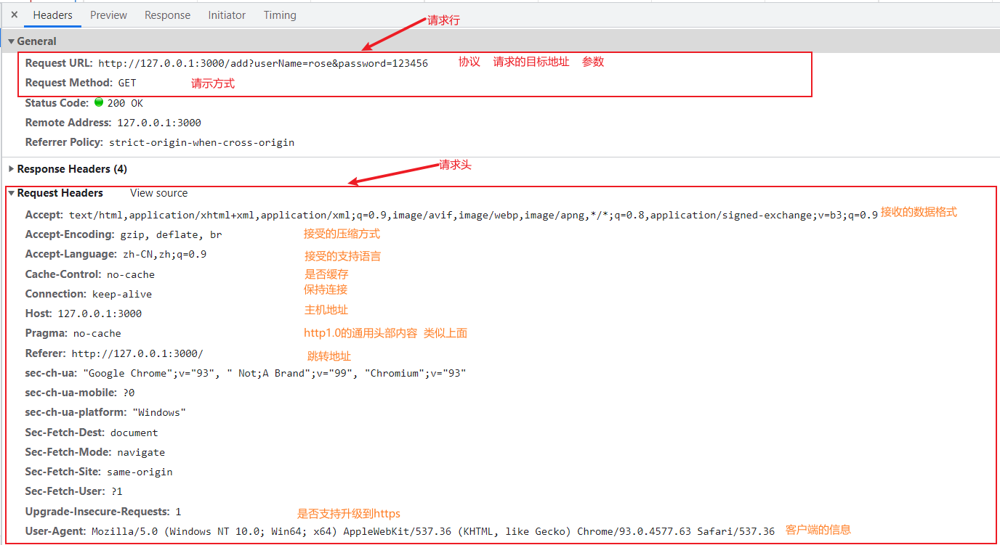

**注**：**GET请求**是通过请求头**拼接参数**的形式的**发送数据**，故**没有请求体**

## 24.2 POST请求报文

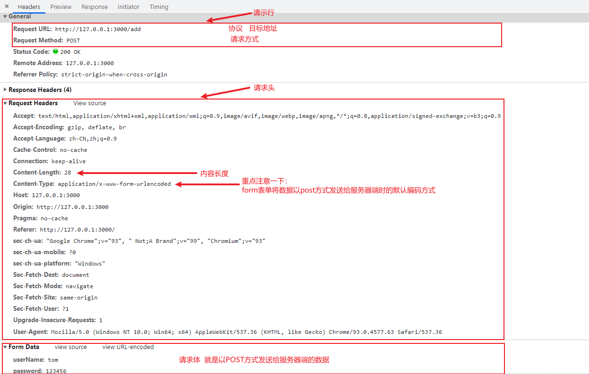

# 25.响应报文分析

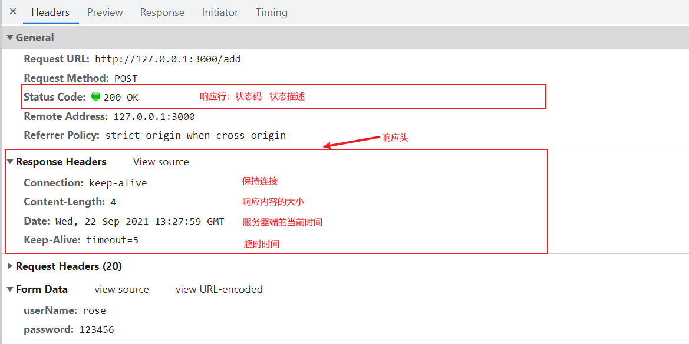

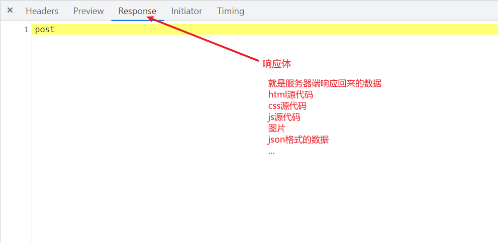

**其它服务器的响应报文，比如Apache服务器的**，如下：

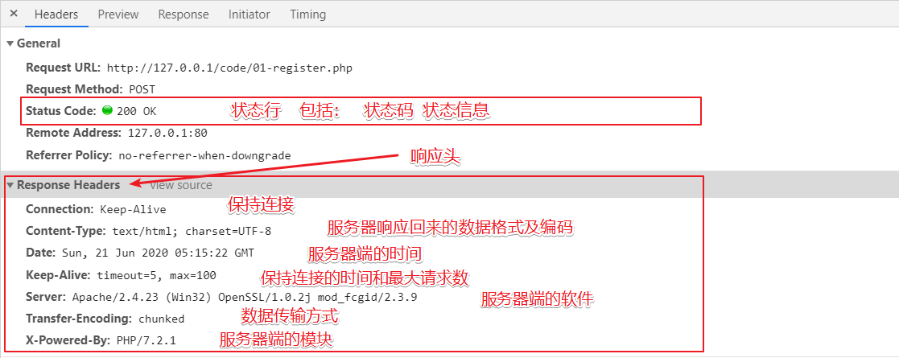


------


# 26.下载工具汇总

## 26.1 NPM

### 介绍

全称：Node Package Manager , Node 的包管理器，也是一个应用程序。

### 包是什么

Node.js 的包基本遵循 CommonJS 规范，将一组相关的模块组合在一起，形成一个完整的工具

### 作用

通过 NPM 可以对 Node 的工具包进行搜索、下载、安装、删除、上传。

借助别人写好的包，可以让我们的开发更加方便。

### 安装

安装完 nodejs 之后会自动安装 npm

## 26.2 常用命令

### 查看 npm 的版本

```sh
npm -v 
```

### 初始化

```sh
npm init
npm init --yes
npm init -y
```

运行后会创建 package.json 文件             

```json
{
  "name": "1-npm",      #包的名字
  "version": "1.0.0",   #包的版本
  "description": "",    #包的描述
  "main": "index.js",   #包的入口文件
  "scripts": {			#脚本配置
    "test": "echo \"Error: no test specified\" && exit 1"
  },
  "author": "",			#作者
  "license": "ISC"		#版权声明
}
```

> ==注意生成的包名不能使用中文，大写 ！！！ 不能使用 npm 作为包的名字==

关于开源证书扩展阅读

<http://www.ruanyifeng.com/blog/2011/05/how_to_choose_free_software_licenses.html>

### <span style="color:blue">搜索包</span>

```sh
npm search jquery
npm s jquery
```

一般在搜索工具包的时候，会到 https://npmjs.org 搜索

### 安装工具包

```sh
npm install jquery
npm i jquery

# 安装并在 package.json 中保存包的信息(dependencies 属性)
npm install jquery --save
npm install jquery -S

# 安装并在 package.json 中保存包的信息(devDependencies 属性)
npm install babel --save-dev
npm install babel -D

```

>  6 版本以后的 npm ，安装包时会自动保存在 dependencies 中，可以不用写 --save

### 全局安装

```sh
npm install less -g
npm install nodemon -g 
```

全局安装一般用于安装全局工具，如 cnpm，yarn，webpack ，gulp等，全局命令的安装位置

```js
C:\Users\你的用户名\AppData\Roaming\npm
```

> 全局安装命令在任意的命令行下, 都可以执行

### 安装依赖

根据 package.json 中的依赖声明， 安装工具包

```sh
npm i
npm install
npm i --production // 只安装 dependencies 中的依赖  只安装上线需要用到的第三方模块 不要开发依赖中的模块 
```

### 移除包

```sh
npm uninstall jquery 
npm remove jquery
```

### 团队开发使用流程

团队开发时使用流程

1. 从仓库中拉取仓库代码
2. 运行 npm install 安装相关依赖
3. 运行项目，继续开发

### 封装 NPM 包

创建自己的 NPM 包可以帮助代码进行迭代进化，使用步骤也比较简单

0. 修改为官方的地址 (  npm config set registry https://registry.npmjs.org/ )

   ~~~js
   npm config set registry https://registry.npmjs.org --global
   npm config set disturl https://registry.npmjs.org --global
   ~~~

1. 创建文件夹，并创建文件 index.js， 在文件中声明函数，使用 module.exports 暴露

2. npm 初始化工具包，package.json 填写包的信息

3. 账号注册（激活账号）,==完成邮箱验证==

4. 命令行下 『npm login』 填写相关用户信息 (一定要在包的文件夹下运行)

5. 命令行下『 npm publish』 提交包 👌

> npm 有垃圾检测机制，如果名字简单或做测试提交，很可能会被拒绝提交
>
> 可以尝试改一下包的名称来解决这个问题

升级 NPM 包，需要修改 package.json 中的版本号修改，只需要执行『npm publish』就可以能提交

1. 修改包代码
2. 修改 package.json 中版本号
3. npm publish 提交

### 删除 npm 包

```
npm unpublish 包名 --force
```

## 26.3 CNPM

### 介绍

cnpm 是淘宝对国外 npm 服务器的一个完整镜像版本，也就是淘宝 npm 镜像，网站地址<http://npm.taobao.org/>

### 安装

安装配置方式有两种

* npm install -g cnpm --registry=https://registry.npm.taobao.org
* alias cnpm="npm --registry=https://registry.npm.taobao.org \
  --cache=$HOME/.npm/.cache/cnpm \
  --disturl=https://npm.taobao.org/dist \
  --userconfig=$HOME/.cnpmrc"       (只能在Linux下使用)

### 使用

配置完成后，就可以使用 cnpm 命令来管理包，使用方法跟 npm 一样

```sh
cnpm install lodash
```

### npm 配置镜像地址

```js
//淘宝镜像
npm config set registry https://registry.npm.taobao.org
//官方镜像   
npm config set registry https://registry.npmjs.org/
```

> 在发布工具的时候, 一定要将仓库地址, 修改为官方的地址  
>
> npm  config list 来查看配置是否成功

## 26.4 Yarn

### 介绍

yarn 是 Facebook 开源的新的包管理器，可以用来代替 npm。

### 特点

yarn 相比于 npm 有几个特点

* 本地缓存。安装过的包下次不会进行远程安装
* 并行下载。一次下载多个包，而 npm 是串行下载
* 精准的版本控制。保证每次安装跟上次都是一样的

### 安装

### yarn 安装

只需要一行命令即可安装 yarn

```sh
npm install yarn -g  // 这样就可以在任何项目中都可以使用yarn命令
```

### msi 安装包安装

<https://classic.yarnpkg.com/en/docs/install#windows-stable>

### 相关命令

yarn 的相关命令

1)  yarn --version

2)  yarn init  //生成package.json   

3)  yarn global add  package (全局安装)

​	全局安装路径 `C:\Users\你的用户名\AppData\Local\Yarn\bin`

4)  yarn global remove less (全局删除)

5)  yarn add package --save(局部安装就是在项目中安装)

6)  yarn add package --dev (相当于npm中的--save-dev)

7)  yarn remove package

8)  yarn list //列出已经安装的包名 用的很少

9)  yarn info packageName //获取包的有关信息  几乎不用

10)  ==yarn== //安装package.json中的所有依赖   yarn 

> npm 5 引入离线缓存，提高了安装速度，也引入了 package-lock.json 文件增强了版本控制

yarn 修改仓库地址

```sh
yarn config set registry https://registry.npm.taobao.org
```

## 26.5 CYarn

跟 npm 与 cnpm 的关系一样，可以为 yarn 设置国内的淘宝镜像，提升安装的速度

```sh
npm install cyarn -g --registry "https://registry.npm.taobao.org"
```

配置后，只需将 yarn 改为 cyarn 使用即可

## 26.6 附录

### 关于版本号

版本格式：主版本号.次版本号.修订号

* "^3.0.0" ：锁定主版本，以后安装包的时候，保证包是3.x.x版本，x默认取最新的。
* "~3.2.x" ：锁定小版本，以后安装包的时候，保证包是3.2.x版本，x默认取最新的。
* "3.1.1" ：锁定完整版本，以后安装包的时候，保证包必须是3.1.1版本。

安装指定版本的工具包

```js
yarn add jquery@1.11.2
```

### npm 清除缓存

```js
npm cache clean
```

# 快捷键

~~~js
ctrl + shift + d   复制当前行到下一行
ctrl + d					依次查找相同项
ctrl + 回车				 从当前行跳转到下一行的开头
ctrl + x 					剪切或删除
ctrl + z 					回退到上一步操作
~~~


------


# 27. 路由的概念

## 1.1 什么是路由

广义上来讲，路由就是**映射关系**。

### 现实生活中


```js
按键 1  ->  业务查询
按键 2  ->  手机充值
按键 3  ->  业务办理
按键 4  ->  密码服务与停复机
按键 5  ->  家庭宽带
按键 6  ->  话费流量
按键 8  ->  集团业务
按键 0  ->  人工服务

在这里，路由是按键与服务之间的映射关系

```

## 1.2 nodejs中的路由

nodejs中的路由其实就是url地址和响应函数之间的映射关系，一个url地址响应一个html页面。

就是将一个路径匹配关系的业务提取到一个单独的js文件当中.


------


# 28. Express

## 28.1 Express 简介

> **基于 Node.js 平台，快速、开放、极简的 web 开发框架**

- [express 官网](http://expressjs.com/)
- [express 中文网](http://expressjs.com.cn/)

```js
1. Express 的作用和 Node.js 内置的 http 模块类似，是专门用来创建 Web 服务器的。
2. Express 的本质：就是一个 npm 上的第三方包，提供了快速创建 Web 服务器的便捷方法。
```

进一步了解express

```js
思考：不使用 Express 能否创建 Web 服务器？
答案：能，使用 Node.js 提供的原生 http 模块即可。

思考：既生瑜何生亮（有了 http 内置模块，为什么还有用 Express）？
答案：http 内置模块用起来很复杂，开发效率低；Express 是基于内置的 http 模块进一步封装出来的，能够极大的提高开发效率。

思考：http 内置模块与 Express 是什么关系？
答案：类似于浏览器中 Web API 和 jQuery 的关系。后者是基于前者进一步封装出来的。

```

## 28.2 基本使用步骤

- 安装：`npm i express`

```js
// 导入 express
var express = require('express')
// 创建 express实例，也就是创建 express服务器
var app = express()


// 启动服务器
app.listen(3000, function () {
  console.log('服务器已启动')
})
```

### 监听get请求

通过 `app.get()` 方法，可以监听客户端的 GET 请求，具体的语法格式如下：

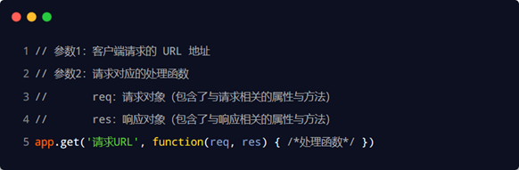

### 监听post请求

通过 `app.post()` 方法，可以监听客户端的 POST 请求，具体的语法格式如下：

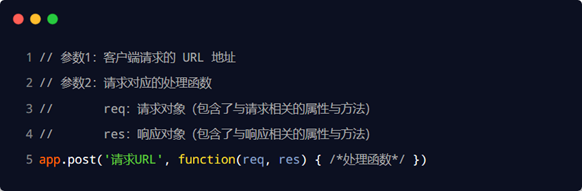


### 响应内容给客户端

通过 res.send() 方法，可以把处理好的内容，发送给客户端：

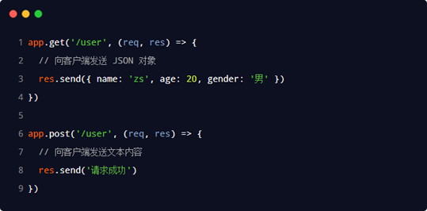


## 28.3 req属性详解

### 获取get请求的参数

通过 req.query 对象，可以获取到客户端通过GET方式，发送到服务器的参数：

比如：http://127.0.0.1:3000/index?id=10&name=tom&age=20

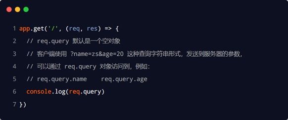

| 名称         | 作用                                                         |
| ------------ | ------------------------------------------------------------ |
| req.query    | 获取Get请求传递过来的参数，拿到的是一个对象                  |
| req.body     | 获取Post请求传递过来的数据，拿到的是一个对象，需要注册一个中间件 |
| req.params   | 获取Get请求中的路由参数，获取的是一个对象                    |
| req.get(key) | 获取请示头中指定Key对应的Value                               |
| req.path     | 获取请求的路径，不带参数                                     |


### 获取post请求的参数

通过`req.body`可以获取post请求的参数，但是需要配合`body-parser`中间件

不再需要使用req.on(‘data’,chunk=>{})         req.on(‘end’,()=>{})

如果没有这个中间件的话，则默认获取的是undefined.

~~~js
// 最新的express版本，不再需要body-parse的下载支持了， 直接按如下的方式来书写即可 
app.use(express.urlencoded({ extended: true }))
app.post('/index',(req,res)=>{
  console.log(req.body);
})
~~~

## 28.4 res属性详解

```js
// send() 发送数据给客户端，并自动设置Content-Type
res.send()

// 发送文件给浏览器，并根据文件后缀名自动设置Content-Type
// 注意：文件路径必须是绝对路径
res.sendFile(path.join(__dirname, 'index.html'))

// 设置响应头
res.set('Content-Type', 'text/plain')
res.set({
  'Content-Type': 'text/plain',
  'cute': 'fangfang'
})

// 重定向 
res.redirect('/index')
```

| 方法               | 作用                                  |
| ------------------ | ------------------------------------- |
| res.send()         | 响应给客户端浏览器的数据,会自带响应头 |
| res.sendFile(path) | 响应给浏览器一个页面                  |
| res.redirect()     | 重定向                                |
| res.set(key,value) | 自定义响应头                          |
| res.status()       | 设置响应状态码                        |

## 28.5 express路由处理

### 基本使用

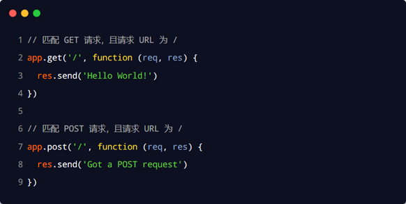

+ `app.get(path, callback)`
+ `app.post(path, callback)`

-  `app.use(path, callback)` 更重要的作用是处理中间件
   - 注意：只要是以path开头的请求地址，都可以被use处理
   - 注意：可以处理任意的请求类型
   - 注意：path参数可省略，默认值为：`/`


### 路由的匹配过程

每当一个请求到达服务器之后，需要先经过路由的匹配，只有匹配成功之后，才会调用对应的处理函数。

在匹配时，会按照路由的顺序进行匹配，如果请求类型和请求的 URL 同时匹配成功，则 Express 会将这次请求，转交给对应的 function 函数进行处理。

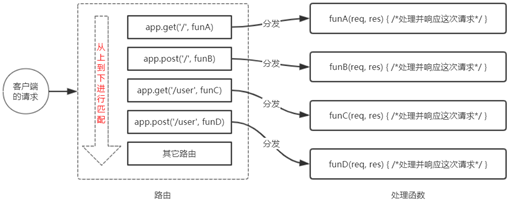

路由匹配的注意点：

①按照定义的先后顺序进行匹配

②请求类型和请求的URL同时匹配成功，才会调用对应的处理函数


### 全局挂载路由

​     在 Express 中使用路由最简单的方式，就是把路由挂载到 app 上，示例代码如下  

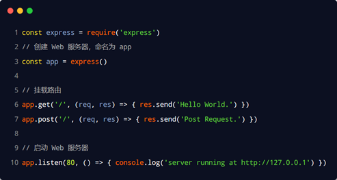


## 28.6 模块化路由

​	为了方便对路由进行模块化的管理，Express **不建议**将路由直接挂载到 app 上，而是推荐将路由抽离为单独的模块。

将路由抽离为单独模块的步骤如下：

①创建路由模块对应的 .js 文件 router.js

②调用 express.Router() 函数创建路由对象

③向路由对象上挂载具体的路由

④使用 module.exports 向外共享路由对象

⑤使用 app.use() 函数注册路由模块

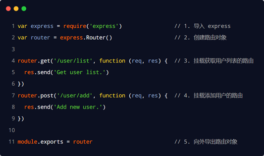

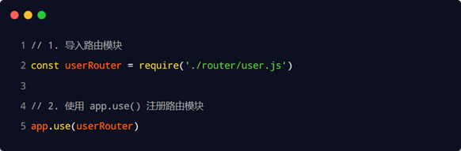

## 28.7 静态资源处理

### 基本使用

> express 提供了一个非常好用的函数，叫做 `express.static()`，通过它，我们可以非常方便地创建一个静态资源服务器，例如，通过如下代码就可以将 public 目录下的图片、CSS 文件、JavaScript 文件对外开放访问了：


```js
现在，你就可以访问 public 目录中的所有文件了：
http://localhost:3000/images/bg.jpg
http://localhost:3000/css/style.css
http://localhost:3000/js/login.js

注意：Express 在指定的静态目录中查找文件，并对外提供资源的访问路径。
因此，存放静态文件的目录名不会出现在 URL 中。
```

### 托管多个资源目录

如果要托管多个静态资源目录，请多次调用 express.static() 函数：


访问静态资源文件时，express.static() 函数会根据目录的添加顺序查找所需的文件。


### 挂载路径前缀

如果希望在托管的静态资源访问路径之前，挂载路径前缀，则可以使用如下的方式：


```js
现在，你就可以通过带有 /public 前缀地址来访问 public 目录中的文件了：
http://localhost:3000/public/images/kitten.jpg
http://localhost:3000/public/css/style.css
http://localhost:3000/public/js/app.js
```


## 28.8 express中间件

### 什么是中间件

中间件（Middleware ）其实就是一个函数，特指业务流程的**中间处理环节**。

分为全局中间件和路由中间件。

### 现实生活中的例子

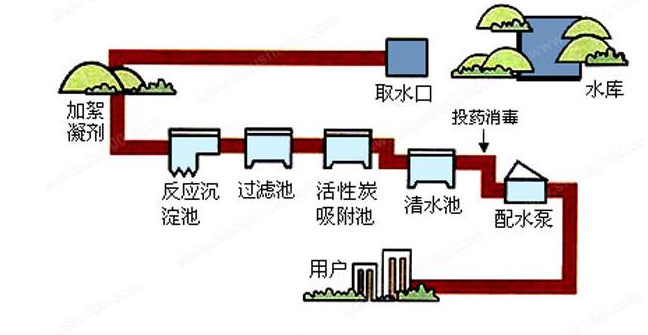

处理污水的这中间处理环节，就可以叫做中间件。


### express中的中间件

当一个请求到达 Express 的服务器之后，可以连续调用多个中间件，从而对这次请求进行预处理。

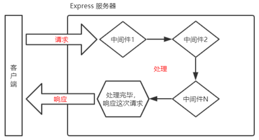

### 基本使用

Express 的中间件，本质上就是一个 **function** **处理函数**，Express 中间件的格式如下：

```js
const mw = function(req, res, next) {
  next()
}
app.use(mw)
```

**注意**：中间件函数的形参列表中，必须包含 next 参数。而路由处理函数中只包含 req 和 res。


next函数的作用： **next** **函数**是实现多个中间件连续调用的关键，它表示把流转关系转交给下一个中间件或路由。


### 中间件的作用

多个中间件之间，**共享同一份** **req** **和** **res**。基于这样的特性，我们可以在上游的中间件中，**统一**为 req 或 res 对象添加自定义的属性或方法，供下游的中间件或路由进行使用。

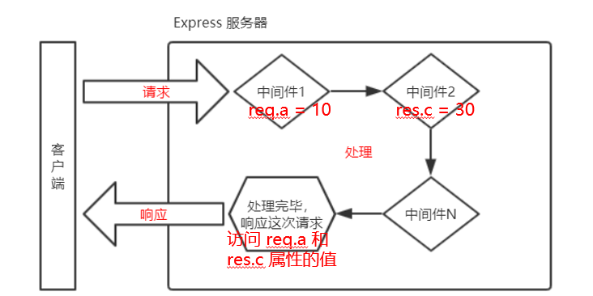

### 定义多个中间件

可以使用 app.use() 连续定义多个全局中间件。客户端请求到达服务器之后，会按照中间件定义的先后顺序依次进行调用，示例代码如下：

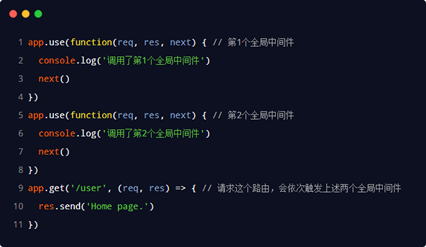


### express内置中间件

自 Express 4.16.0 版本开始，Express 内置了 3 个常用的中间件，极大的提高了 Express 项目的开发效率和体验：

① express.static 快速托管静态资源的内置中间件，例如： HTML 文件、图片、CSS 样式等（无兼容性）

② express.json 解析 JSON 格式的请求体数据（有兼容性，仅在 4.16.0+ 版本中可用）

③ express.urlencoded 解析 URL-encoded 格式的请求体数据（有兼容性，仅在 4.16.0+ 版本中可用）

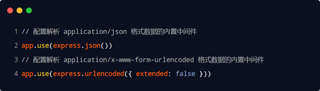

# 29.EJS模板

## 29.1 ejs介绍

ejs是一个高效的javascript模板引擎，是为了使用户页面与业务数据(分离)而产生的。

简单来说，使用ejs模板引擎就可以帮助我们快速的将数据渲染到页面对应的位置，和art-template模板类似.

## 29.2 ejs的使用

1.下载

~~~js
npm i ejs
~~~

2.配置模板引擎

~~~js
app.set('view engine','ejs')
~~~

3.配置模板的存放目录

~~~js
app.set('views','./views')
~~~

4.在views目录下创建模板文件     ***.ejs

5.使用模板渲染数据

~~~js
res.render('index',obj)
~~~

## 29.3 数据渲染

include


