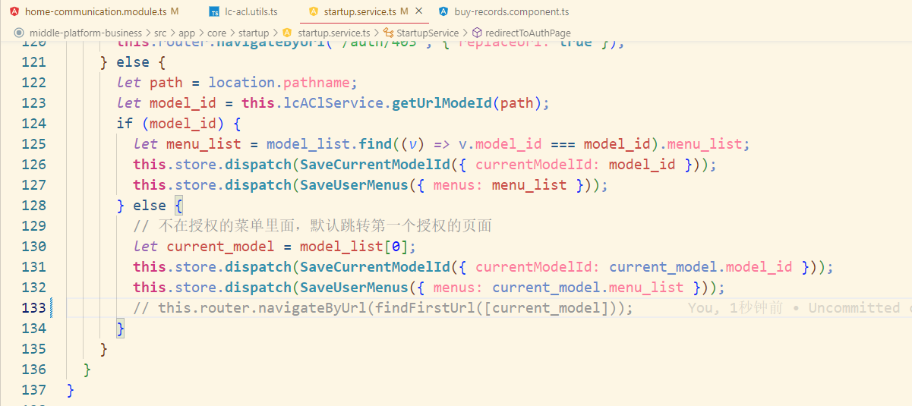

# 配置备份

> ```
> "start": "npx ng serve --host 0.0.0.0 --port 3467",
> "start": "npx ng serve --host 192.168.1.66",
> ```
>
>   
>
>  
>
> ```
> "start": "npx ng serve --host 0.0.0.0 --port 4200",
> "start": "npx ng serve --host 192.168.1.66",
> ```
>
> 


# 配置跳转指定路由注释startup文件的这行代码





# 团餐后台账号与机构

```css
账号：
18202792720

密码：
cs123456
```


> ​												光谷利楚支付宝高校


