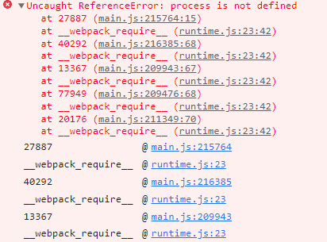
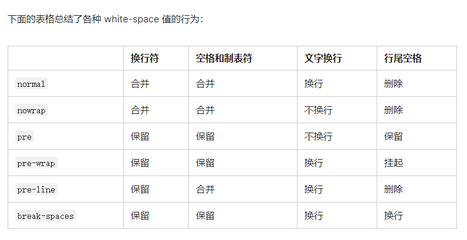

# `nrm ls`不显示`*`号、`nrm current`无用

##### 解决

> 打开文件``cli.js``
>
> Modify 211 lines of code in cli.js,The problem can be solved by changing && to ||.
>
>  译：修改``cli.js``文件的``211``行代码，这个问题可以通过把``&&`` 改为 ``||``解决。


# Uncaught ReferenceError: process is not defined

##### 解决

> 
>
> polyfills.ts文件加上这行代码:
>
> ```typescript
> (window as any).process = { env: { DEBUG: undefined }, };
> ```
>
> 


# 字符串在html中的页面中的换行

`white-space: pre-line` 加这个样式即可换行




