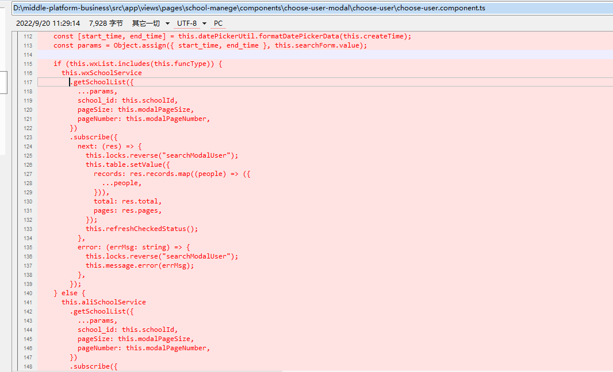
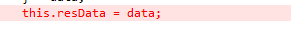

### 新增页面按用户发放 查询接口


> ok


> ok


> ok




> ok


### 丑

> ok


​	


### 	原子类

> ok


### indexOf 与 includes

> ok




> ok


### ifelseif

```
ok
```


### 写死  删变量

> ok


### 选择用户为空 提示“请选择用户”拦截

> ok


### 新增页面按用户发请求

> ok


### 双等改为全等

> ok


```js
let res = LCValidators.formCheck(this.canBuForm);
if (!res) {
    return;
}
if (this.locks.getLock("canbuConfirm")) return;
this.locks.reverse("canbuConfirm");
let selectList = [];
if (this.canBuForm.value.canbu_switch === 2 && this.canbuNodes.length) {
    selectList = this.toolUtil.transCheckedTreeIdList(this.canbuTree.getCheckedNodeList(), selectList);
    if (selectList.length === 0) {
        this.locks.reverse("canbuConfirm");
        this.message.error("请选择分组");
        return;
    }
}

let user_role_bean_list = [];
if (this.canBuForm.value.canbu_switch === 3) {
    user_role_bean_list = this.canBuForm.value.user_role_bean_list.filter((i) => i.checked);
    if (user_role_bean_list.length === 0) {
        this.locks.reverse("canbuConfirm");
        this.message.error("请选择角色");
        return;
    }
}

let agreement_Id_and_user_no_list = [];
if (this.canBuForm.value.canbu_switch === 4) {
    agreement_Id_and_user_no_list = this.canBuForm.value.agreement_Id_and_user_no_list;
    if (agreement_Id_and_user_no_list.length === 0) {
        this.locks.reverse("canbuConfirm");
        this.message.error("请选择用户");
        return;
    }
}

// let selectList = [];
// if (this.canBuForm.value.canbu_switch === 2 && this.canbuNodes.length) {
//   selectList = this.toolUtil.transCheckedTreeIdList(this.canbuTree.getCheckedNodeList(), selectList);
// }
// let user_role_bean_list = this.canBuForm.value.user_role_bean_list.filter((i) => i.checked);
// let agreement_Id_and_user_no_list = this.canBuForm.value.agreement_Id_and_user_no_list;

let arr = [];
```


```js
//消费账户用户
renderCanbuUser() {
    if (this.selectedUsers.length || this.locks.getLock("canbuUser")) return;
    this.locks.reverse("canbuUser");
    this.k12SchoolService
        .getSchoolUser({
        school_id: this.canBuForm.value.school_id,
        type: 2,
        pageNumber: 1,
        pageSize: 1000,
    })
        .subscribe(
        (data) => {
            this.selectedUsers = data.records;
            this.canBuForm.patchValue({
                ["agreement_Id_and_user_no_list"]: data.records.map((item) => {
                    return { agreement_id: item.id, user_no: item.user_no };
                }),
            });
        },
        (error) => {
            this.message.error(error);
            this.locks.reverse("canbuUser");
        }
    );
}
```


