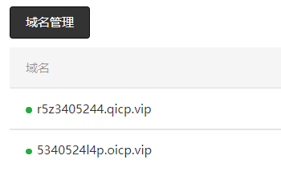

[TOC]


# 基本语法


### 1. 动态数据都用双大括号：`{{ }}`

### 2. wx:for="{{}}"直接写数组，内置了item与item

> 多层嵌套列表渲染要给item和item起别名，在官网查询


### 3. wx:key="" 不用加大胡子括号

### 4. 事件绑定

```js
冒泡事件和非冒泡事件

bindtap绑定的事件触发后还会向上级冒泡 
catchtap绑定的事件触发后会阻止冒泡，也就是不会向上级冒泡

事件对象还是event  
	内部 event.target 拿到的是用户点击的目标元素
	内部 event.currentTarget 拿到的是绑定事件的元素
```


### 5. input收集数据

```js
输入框输入值不是通过 event.target.value 获取

而是通过 event.detail.value 获取
```


# 文件说明

```js
小程序初始化项目文件介绍
	小程序的全局对象是微信  wx

	小程序开发文档简介  
		页面的配置和语法找框架
		页面的布局搭建找组件
		实现特定功能的时候找API


project.config.json： 项目的配置文件   文件会自动生成，不用管
sitemap.json：新添加的  开关来配置其小程序页面是否允许微信索引，有介绍可以看

	app.js:       App() 必须在 app.js 中调用，必须调用且只能调用一次。不然会出现无法预期的后果。
	app.json:     当前小程序应用的配置项  参考官网一个一个看 (全局配置)
	app.wxss:     当前小程序应用的全局css样式
	pages:        页面相关的介绍
	utils:	      到时候自己封装
```


# 发请求 wx.Request

```js
wx.request({
    url: 'example.php', //仅为示例，并非真实的接口地址
    data: {
        x: '',
        y: ''
    },
    header: {
        'content-type': 'application/json' // 默认值
    },
    success (res) {
        console.log(res.data)
    }
})
```


# 获取用户基本信息

```js
getUserProfile(e) {
    // 推荐使用 wx.getUserProfile 获取用户信息，开发者每次通过该接口获取用户个人信息均需用户确认
    // 开发者妥善保管用户快速填写的头像昵称，避免重复弹窗
    wx.getUserProfile({
        desc: '用于完善会员资料', // 声明获取用户个人信息后的用途，后续会展示在弹窗中，请谨慎填写
        success: (res) => {
            this.setData({
                userInfo: res.userInfo,
                hasUserInfo: true
            })
        }
    })
},
```


# 存数据（响应式）

```js
this.xxx = xxx	这样去存储的数据不是响应式

调用 setData 这样做数据才是响应式
this.setData({
    userInfo:res.userInfo
})

```


# 调试工具

> `AppData`


# 路由

```js
wx.reLaunch
关闭所有页面，打开到应用内的某个页面。可以跳到 tabbar 页面。


wx.redirectTo
关闭当前页面，跳转到应用内的某个页面。但是不能跳到 tabbar 页面。


wx.navigateTo
保留当前页面，跳转到应用内的某个页面。但是不能跳到 tabbar 页面。
wx.navigateTo({
  url: '/pages/index/index',	绝对路径
  events: {
    // 为指定事件添加一个监听器，获取被打开页面传送到当前页面的数据
    acceptDataFromOpenedPage: function(data) {
      console.log(data)
    },
    someEvent: function(data) {
      console.log(data)
    }
  },
  success: function(res) {
    // 通过 eventChannel 向被打开页面传送数据
    res.eventChannel.emit('acceptDataFromOpenerPage', { data: 'test' })
  }
})
```


# 页面生命周期

```js
navigateTo和redirectTo对比

五个钩子：

	onLoad    
    	监听页面加载，页面创建时执行      			
	    只会执行一次
        像created
	onShow    
    	监听页面显示，页面在前台显示的时候执行  		
	    会执行多次，初始化阶段执行一次  
	    像beforeMount
	onReady   
    	监听页面初次渲染完成，页面第一次渲染完成执行  
	    只会执行一次
	    像mounted


	onHide        
    	页面在后台隐藏的时候执行  
	    会执行多次 
	onUnload      
    	页面销毁的时候执行    
	    只会执行一次
```


# storage存储

> **小程序设置storage不需要转化json字符串**


# 上拉触底和下拉刷新

> **下拉刷新 需要配置`scroll-view`的`refresher-enabled`为`true`** 


```js
当用户下拉刷新的时候，需要重新发请求获取列表数据   
	绑定事件bindrefresherrefresh

用户下拉刷新的时候，需要出现标识（三个点），当数据请求回来了，需要取消标识（去掉三个点）
	下拉刷新标识refresher-triggered
```


```js
上拉触底后，需要添加新的视频列表数据，目前没有api，可以自己手动添加数据
	绑定bindscrolltolower
```


# npm的使用和安装pubsub-js，

```js
npm在小程序当中使用：

初始化包  npm init

下载	npm i pubsub-js  

每安装一个包都要去工具当中构建一次npm   让小程序可以找到

```


------


# 分包

### 常规分包特点： **************************************************

- 除了分包的内容都会打包到主包当中
- 主包一般都要有启动页/tabBar页面
- 分包不能嵌套
- 分包可以使用主包的资源，不能使用其它分包的资源
- 点击需要访问分包的页面才会加载分包


> **总结：**
>
> 1、先把主包当中需要分的包页面拿过来，形成分包package
> 2、配置分包声明
> 3、配置好了，可以重新编译代码，可以正常打开，并且在预览或者详情当中可以查看分包信息
> 4、分包虽然可以使用主包里面的资源，但是之前我们所写的路径可能有问题，所以要去查看分包里面的路径，修改正确


### 独立分包

​	按照官方把推荐和歌曲详情分包 添加一个字段`"independent": true`就变为独立分包
​	

```js
独立分包可以不用加载主包，独立分包不依赖主包资源************************
    
当依赖主包的资源的时候出问题
	需要给分包拷贝一份资源
	需要在分包内部也引入一次
	高度也会出问题

如果一些页面功能比较独立，可以使用独立分包
```


------

# 真机调试内网穿透

##### 1. 工具：花生壳

> 账号：15623151121
>
> 密码：fyxxxxxx

##### 2. 新增映射

> - 外网域名
>
>   ​	5340524l4p.oicp.vip
>
> - 外网端口
>
>   ​	默认443			//不可更改
>
> - 内网主机
>
>   ​	127.0.0.1			//也就是localhost
>
> - 内网端口
>
>   ​	3001				//根据后端服务器监听的端口
>
>   
>
>   **服务器`server.js`文件：**
>
>   
>
>   ```js
>   
>   let Koa = require('koa');
>   let router = require('./router');
>   
>   // 1. 生成应用实例
>   const app = new Koa();
>   
>   // 4. 声明使用中间键
>   app
>   	.use(router.routes()) // 使用路由
>   	.use(router.allowedMethods()) // 使用注册路由方法
>   
>   // 2. 监听端口
>   app.listen('3001', (err) => {
>   	if(err){
>   		console.log(err);
>   		return;
>   	}
>   	
>   	console.log('服务器启动成功');
>   	console.log('服务器地址： http://localhost:3001');
>   });
>   ```
>
> 

##### 3. uniapp里修改utils里的`request.js`文件url地址为花生壳给的域名

> **①花生壳现在给了两个域名**
>
> 
>
> **②oicp支持https协议类型。http协议已经下架，但之前的会保留，删除后不可再添加，以后都是https。**
>
> 
>
> **③每个域名仅支持1条HTTPS映射**
>
> 
>
> 


```js
function request(url, data = {}, method = "GET") {
    return new Promise((resolve, reject) => {
        uni.request({
            url: 'http://localhost:3001' + url, //仅为示例，并非真实接口地址。
            // url: 'http://r5z3405244.qicp.vip' + url, //仅为示例，并非真实接口地址。
            url: 'https://5340524l4p.oicp.vip' + url, 

            data,
            method,
            header: {
                'custom-header': 'hello' //自定义请求头信息
            },
            success: (res) => {
                resolve(res)
            },
            fail: (error) => {
                reject(error)
            }
        });
    })
}

export default request
```


##### 4. 关于花生壳账号登录问题：

- 网页版不算登录，必须使用花生壳软件登录，否则会提示设备不存在


------

# 其他


### 1.BackgroundAudioManager，有一个必填项

##### string title

音频标题，用于原生音频播放器音频标题**（必填）**。原生音频播放器中的分享功能，分享出去的卡片标题，也将使用该值。


